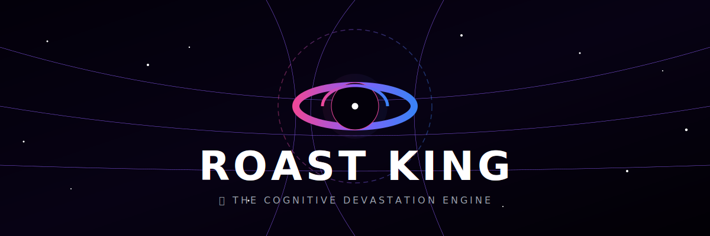

<!-- Animated Cosmic Header Banner -->
<p align="center">
  
</p>

<!-- Dynamic Typing SVG Subtitle -->
<p align="center">
  <a href="https://git.io/typing-svg">
    
  </a>
</p>

<!-- Technology Badges -->
<p align="center">
  
  
  
  
  
  
</p>

<p align="center">
  <a href="https://venkatesh-0007.github.io/Roast_King/"><strong>Explore Live Station 🪐</strong></a> |
  <a href="#-quick-start"><strong>Launch Locally 🚀</strong></a> |
  <a href="#-cosmic-modes"><strong>Roast Intensities 🔥</strong></a>
</p>

<p align="center">
  
</p>

## 🌌 The Roast King Universe

> *"Got a big ego? We'll bring it back to Earth. Because in the grand scheme of the universe, you're still a nobody."*

**Roast King** is a futuristic, cosmic-themed flex roasting web application. Submit your achievements, career flexes, or life statistics, and watch our AntiGravity engine tear them to cosmic dust with gravity-defying burns. The application features three stages of cosmic intensity, reactive spacetime grid warping, fluid physics-based transitions, and synthesized space soundscapes.

<p align="center">
  
</p>

## 🔥 Cosmic Modes

Roast King adapts its appearance, animations, and roasting severity through three planetary presets.

<table width="100%">
  <tr>
    <td width="33%" align="center">
      <h3>🌊 Gentle Orbit</h3>
      <p><i>"Soft landing, friendly orbital jabs."</i></p>
      <p>A calm cyan planet with slow, soothing ripples. Perfect for sensitive egos and light-hearted jokes.</p>
    </td>
    <td width="34%" align="center">
      <h3>☄️ Meteor Strike</h3>
      <p><i>"Heavy impacts, visible craters."</i></p>
      <p>A hot purple planet surrounded by orbiting meteors. Unleashes fiery burns that leave permanent damage.</p>
    </td>
    <td width="33%" align="center">
      <h3>🕳️ Black Hole</h3>
      <p><i>"Not even light (or your dignity) escapes."</i></p>
      <p>A warping black sphere with a vibrant neon accretion disk. Absolute, ego-annihilating devastation.</p>
    </td>
  </tr>
</table>

<p align="center">
  
</p>

## 🪐 Interactive Features

- ⚛️ **Spacetime Grid Warping** — Hover over the interactive gravity core and watch the grid mesh warp and bend under your mouse coordinates, mimicking actual gravitational fields.
- 🧊 **Liquid Glass Interface** — The UI features premium iOS-inspired glassmorphism panels with rich backdrop blur filters, glowing border accents, and responsive hover highlights.
- 🎵 **Synthesized Soundscapes** — Driven entirely by the native **Web Audio API** (no bulky audio assets). Generates organic planetary hums, UI clicks, meteor swooshes, and black hole resonance on the fly.
- ⭐ **Starred Flex Archive** — Keep track of the best burns. Save roasts to your cosmic vault, persistent across browser sessions using `localStorage` caching.
- 📊 **Ego Damage Analytics** — Every roast calculates a dynamic Gravity Score, showing key stats like *Ego Damage*, *Burn Intensity*, and a visual gauge meter showing how badly you were scorched.

<p align="center">
  
</p>

## 🛠️ Tech Stack

| Component | Technology | Purpose |
|---|---|---|
| **Core Framework** | **React 19** | Declarative component architecture & state scheduling. |
| **Bundler / Tooling** | **Vite 8** | Ultra-fast Hot Module Replacement & production bundling. |
| **Styling Engine** | **Tailwind CSS v4** | Modern utility-first styling with native CSS variables. |
| **Motion & Physics** | **Framer Motion** | Physics-based micro-interactions and transitions. |
| **Vector Assets** | **Lucide React** | Clean, responsive, and customizable SVG iconography. |
| **Visual FX** | **Canvas Confetti** | Dynamic celebration effects for mild/gentle achievements. |
| **Audio Synthesizer** | **Web Audio API** | Dynamic real-time browser synthesizer for interactive SFX. |

<p align="center">
  
</p>

## 🚀 Quick Start

### 📋 Prerequisites

Make sure you have [Node.js](https://nodejs.org/) (v18 or higher) and npm installed.

### ⚙️ Installation

```bash
# Clone the repository
git clone https://github.com/venkatesh-0007/Roast_King.git
cd Roast_King

# Install project dependencies
npm install

# Start the dev server
npm run dev
```

The server will spin up on [http://localhost:5173/Roast_King/](http://localhost:5173/Roast_King/).

### 📦 Production Build

To create an optimized production bundle:

```bash
npm run build
```

Production output will be generated inside the `/dist` directory, fully prepared for static hosting platforms.

<p align="center">
  
</p>

## 🏗️ Repository Blueprint

```
Roast_King/
├── .github/
│   └── workflows/
│       └── deploy.yml          # GitHub Pages CI/CD automation workflow
├── public/
│   ├── favicon.svg             # Application favicon
│   ├── icons.svg               # SVG Icon Spritesheet
│   ├── banner.svg              # Animated Header Banner
│   └── divider.svg             # Animated Section Dividers
├── src/
│   ├── components/
│   │   ├── CosmicBackground.jsx    # Starfield particle canvas background
│   │   ├── HistoryDrawer.jsx       # Saved roasts sidebar list
│   │   ├── InteractivePlanet.jsx   # Mouse-reactive gravity sphere canvas/SVG
│   │   ├── RoastForm.jsx           # Flexible user inputs and intensity toggles
│   │   ├── RoastResults.jsx        # Burn readout cards with gauge indicator
│   │   └── TrendingFlexes.jsx      # Ready-made presets for quick burning
│   ├── services/
│   │   ├── audio.js                # Web Audio API Synth Engine
│   │   └── roastEngine.js          # Client-side roasting and analytics generator
│   ├── App.jsx                     # Core application orchestrator
│   ├── index.css                   # Global styling reset & design systems
│   └── main.jsx                    # React mounting module
├── index.html                  # Core HTML file
├── vite.config.js              # Vite configuration with Tailwind CSS integration
├── package.json
└── LICENSE                     # MIT License
```

<p align="center">
  
</p>

## 📝 License

Distributed under the **MIT License**. Check out the [LICENSE](./LICENSE) file for details.

<br>

<p align="center">
  🌌 Designed and Engineered by <a href="https://github.com/venkatesh-0007">Venkatesh</a><br>
  <em>No cosmic fields or gravity grids were harmed in the making of this station.</em>
</p>
